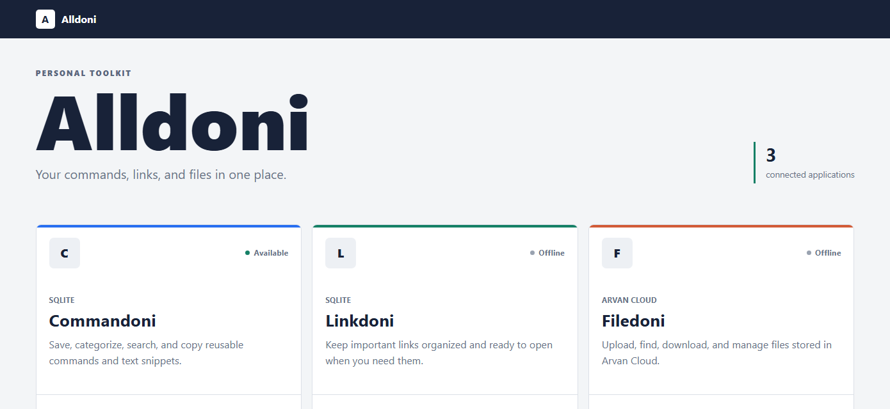

# Alldoni



Alldoni is a .NET 10 workspace containing a central Super App and three small personal library applications:

- **Alldoni** is the central hub for opening and checking the availability of every application.
- **Commandoni** stores searchable commands and text snippets in SQLite.
- **Linkdoni** stores searchable links with names, categories, and optional descriptions in SQLite.
- **Filedoni** uploads, lists, downloads, searches, and deletes files in Arvan Cloud Object Storage.

All projects use Razor Pages for their interfaces. Commandoni and Linkdoni also expose Minimal API endpoints.

## Projects

| Project | Storage | Purpose |
| --- | --- | --- |
| `Alldoni/` | Configuration | Central application hub |
| `Commandoni/` | SQLite | Commands and reusable text |
| `Linkdoni/` | SQLite | Important links and bookmarks |
| `Filedoni/` | Arvan S3-compatible storage | Private file storage |

The parent solution is `Alldoni.slnx`.

## Requirements

- .NET 10 SDK
- An Arvan Cloud Object Storage bucket for Filedoni
- S3-compatible Arvan access and secret keys

## Build

```powershell
dotnet restore Alldoni.slnx
dotnet build Alldoni.slnx
```

## Run

Run each application in a separate terminal:

```powershell
dotnet run --project Alldoni\Alldoni.csproj
dotnet run --project Commandoni\Commandoni.csproj
dotnet run --project Linkdoni\Linkdoni.csproj
dotnet run --project Filedoni\Filedoni.csproj
```

Open the Super App at `http://localhost:5050`. Its application URLs can be changed in `Alldoni/appsettings.json` or overridden through configuration.

Commandoni and Linkdoni create their `App_Data` directories and SQLite databases automatically on first run.

## IIS

Publish outputs can be installed as four always-running local IIS sites by opening PowerShell as Administrator and running:

```powershell
powershell -NoProfile -ExecutionPolicy Bypass -File .\scripts\deploy-all-iis.ps1
```

The sites use ports `5050` (Alldoni), `5094` (Commandoni), `5165` (Linkdoni), and `5276` (Filedoni).

Configure Filedoni on IIS without placing credentials in the repository:

```powershell
powershell -NoProfile -ExecutionPolicy Bypass -File .\scripts\configure-filedoni-storage.ps1
```

The script stores restricted production settings under `C:\inetpub\Filedoni` and restarts the Filedoni application pool. The deployment script preserves this production file during future updates.

## Configure Filedoni

Keep real credentials outside `appsettings.json`. For local development:

```powershell
dotnet user-secrets --project Filedoni\Filedoni.csproj set "ArvanStorage:Endpoint" "https://s3.ir-thr-at1.arvanstorage.ir"
dotnet user-secrets --project Filedoni\Filedoni.csproj set "ArvanStorage:Region" "ir-thr-at1"
dotnet user-secrets --project Filedoni\Filedoni.csproj set "ArvanStorage:BucketName" "your-bucket-name"
dotnet user-secrets --project Filedoni\Filedoni.csproj set "ArvanStorage:AccessKey" "your-access-key"
dotnet user-secrets --project Filedoni\Filedoni.csproj set "ArvanStorage:SecretKey" "your-secret-key"
```

For a deployed instance, define the equivalent environment variables:

```text
ArvanStorage__Endpoint
ArvanStorage__Region
ArvanStorage__BucketName
ArvanStorage__AccessKey
ArvanStorage__SecretKey
```

Filedoni uses the `filedoni/files` prefix, allowing it to share a bucket without mixing its objects with other applications.

## Deploy Filedoni

The project includes a production Dockerfile:

```powershell
docker build -f Filedoni\Dockerfile -t filedoni .
docker run --rm -p 8080:8080 `
  -e ArvanStorage__BucketName="your-bucket-name" `
  -e ArvanStorage__AccessKey="your-access-key" `
  -e ArvanStorage__SecretKey="your-secret-key" `
  filedoni
```

Deploy this image to an Arvan container application and configure the five `ArvanStorage__...` environment variables in the application settings. Do not bake credentials into the image.

## API

- Commandoni: `/api/snippets`
- Linkdoni: `/api/links`
- Filedoni status: `/api/status`
- Filedoni files: `/api/files`

Swagger is intentionally not enabled; the APIs are small companions to the Razor interfaces.
